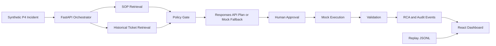

# Architecture

NEXUS-RESOLVE is split into a static replay dashboard and a local live backend.
The static mode is safe for GitHub Pages because it uses only synthetic replay
events. The local mode keeps API keys and live Responses API calls on the
developer machine.

## Data Flow

1. The run starts from `INC-2026-00421`, a synthetic P4 disk-space alert.
2. The orchestrator retrieves `SOP-WIN-DISK-001`.
3. Historical tickets are loaded from JSONL and classified into safe examples,
   unsafe precedent, and escalation precedent.
4. The plan is generated through OpenAI Responses API when configured, otherwise
   a deterministic fallback plan is used.
5. Policy checks block protected paths, missing age filters, missing approval,
   missing dry-run guard, missing validation, and real execution markers.
6. The workflow pauses until human approval.
7. The mock executor changes only synthetic state and never touches the host.
8. Validation and RCA events are streamed to the dashboard and exported.

## Runtime Boundaries

- Browser replay mode: no backend, no secrets, static JSONL event playback.
- Local live mode: FastAPI, WebSocket, optional OpenAI key, mock-only execution.
- GitHub Pages: publishes `apps/dashboard/dist` only.

