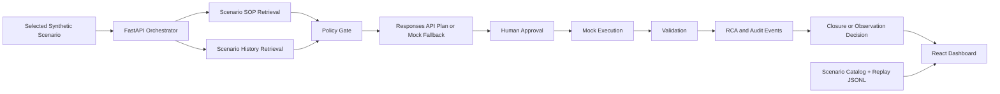

# Architecture

NEXUS-RESOLVE is split into a static replay dashboard and a local live backend.
The static mode is safe for GitHub Pages because it uses only synthetic replay
events. The local mode keeps API keys and live Responses API calls on the
developer machine.

## Data Flow

1. The run starts from the selected scenario, defaulting to `disk-space`.
   `GET /api/connectors/servicenow/mock-ticket/{scenario_id}` exposes the same
   selected scenario as a ServiceNow-style synthetic ticket contract.
2. The orchestrator retrieves the scenario-specific SOP.
3. Historical tickets are loaded from the scenario catalog and classified into safe examples,
   unsafe precedent, and escalation precedent.
4. The plan is generated through OpenAI Responses API when configured, otherwise
   a deterministic fallback plan is used.
5. Policy checks block protected resources, missing safeguards, missing approval,
   missing dry-run/mock guard, missing validation, and real execution markers.
6. The workflow pauses until human approval.
7. The mock executor changes only synthetic state and never touches the host.
8. Validation and RCA events are streamed to the dashboard and exported.
9. The operator closes the incident or starts a synthetic observation window;
   observation rechecks recovery metrics and then closes the incident.
10. Any active run can expose a hashed audit packet through
    `GET /api/runs/{run_id}/audit-packet`; the packet includes run status,
    events, approval record, policy checks, RCA, and safety metadata.

## Runtime Boundaries

- Browser replay mode: no backend, no secrets, static JSONL event playback.
- Local live mode: FastAPI, WebSocket, optional OpenAI key, mock-only execution.
- GitHub Pages: publishes `apps/dashboard/dist` only.
- Judge deep-dive mode: static page on port 5174 that embeds the real dashboard,
  fetches live FastAPI JSON when available, and labels trace replay separately.
